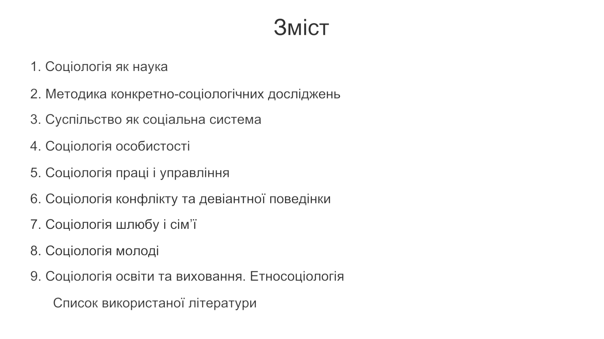
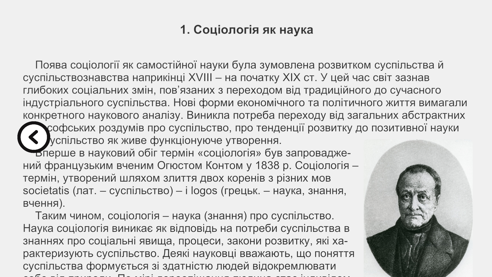
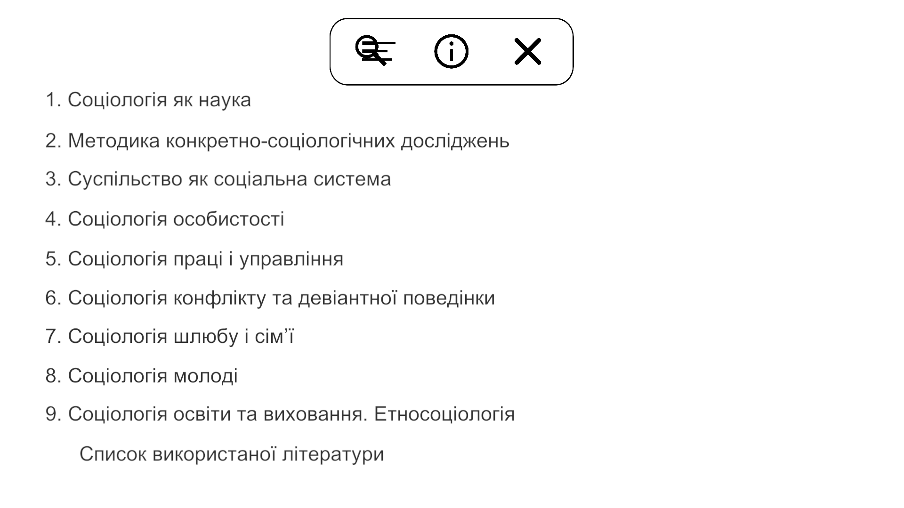
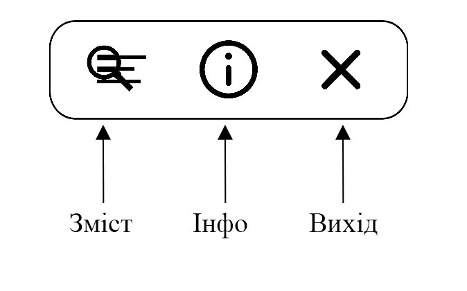
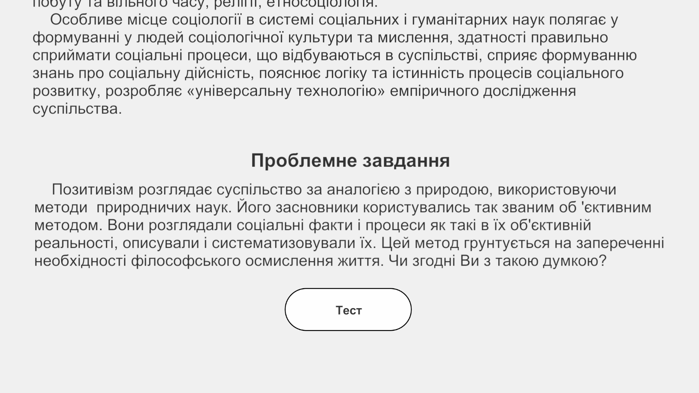
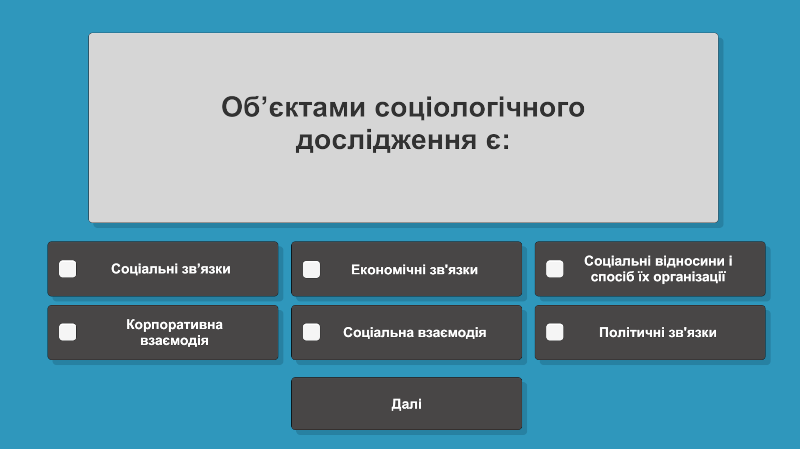
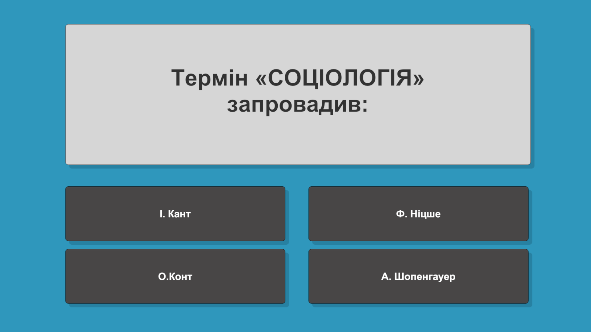
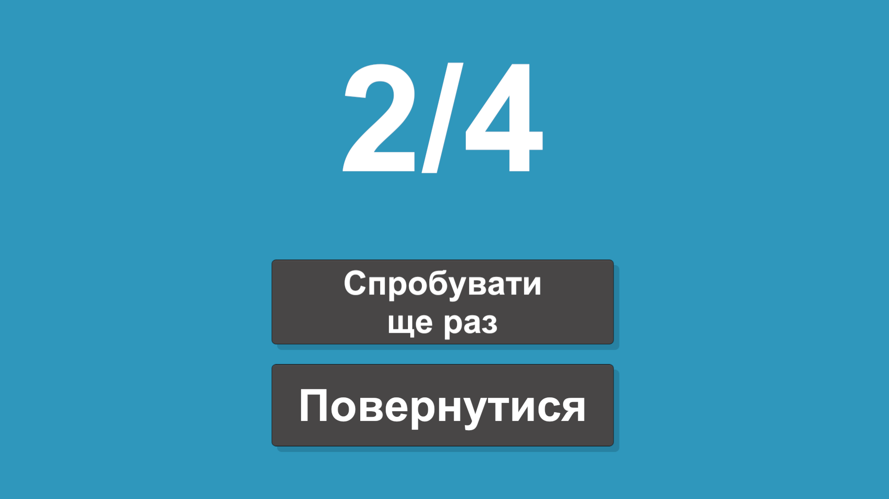

# Philosophy
## Як працює програма?
### Навігація
Для запуску програми використовуємо відповідний exe файл 'Philosophy.exe'.
Після запуску з'явиться обкладинка посібника.

Для продовження просто натисніть на ліву кнопку миші будь-де на екрані. Далі відкриється "Зміст".

На вибір будуть дані 16 тем. Можна як натиснути на будь-яку з них, щоб перейти до неї, а можна перейти на наступну сторінку, яка веде до першої теми, наведенням курсору миші в праву сторону й натисненням на кнопку, або за допомогою клавіші стрілки вправо. Для прокручування сторінки можна використовувати колесико миші, або відповідними стрілочками на клавіатурі (вгору-вниз).

Перехід на сторінку за допомогою натисканням на тему:

Перехід за допомогою натисканням на кнопку:

Також, відповідно, щоб повернутися на попередню сторінку, можна навести курсор миші наліво й натиснути на кнопку, що з'явиться:

Якщо навести курсор миші на верхній край монітору, то з'явиться панель-меню.

На цій панелі розташовані 3 кнопки: "Зміст", "Інфо", "Вихід".

### Тест
В кінці кожної теми можна помітити кнопку "Тест".

Після натиснення Ви почнете проходити цікавий тест під музику. Тести мають два види: з однією правильною відповіддю та з декількома. Для того, щоб зарахувати питання з декількома відповіддями просто виберіть, на вашу думку, правильні варіанти відповідей й натисніть кнопку "Далі". Для зарахування питання з однією правильною відповіддю просто натисність на варіант, який, на вашу думку, є правильним:

Після проходження тесту Вас зустріне вікно з результатом:

В цьому вікні буде дано на вибір дві кнопки: "Спробувати ще раз" та "Повернутися". Якщо натиснути на кнопку "Спробувати ще раз", то ви зможете пройти тест ще раз для кращого результату, а якщо вибрати "Повернутися", то ви повернетеся на сторінку, з якої ви перейшли до даного тесту.
